<div align="center">


# CVForge

**A lightweight Computer Vision CLI toolkit written in Go**

A modular image processing framework featuring classic computer vision algorithms implemented from scratch in pure Go.

<p>


</p>

</div>

---

## Overview

**CVForge** is a lightweight Computer Vision command-line toolkit implemented entirely in **Go**.

Unlike wrappers around OpenCV, CVForge focuses on implementing classical image processing algorithms from scratch while maintaining a clean, modular architecture.

It is designed for both practical image processing and educational purposes.

---

# Features

## Geometry

- Resize
- Rotate
- Crop

## Color Processing

- Grayscale
- Histogram Equalization

## Blur

- Box Blur
- Gaussian Blur
- Median Blur

## Image Enhancement

- Sharpen
- Emboss

## Edge Detection

- Sobel Edge Detection

## Thresholding

- Binary
- Binary Inverse
- Truncate
- To Zero
- To Zero Inverse

## Morphology

- Erosion
- Dilation
- Opening
- Closing

---

# Example Results

## Original

| Original |
|----------|
| 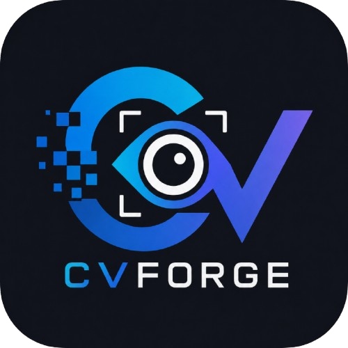 |

---

## Basic Filters

| Grayscale | Gaussian | Median |
|-----------|----------|--------|
| 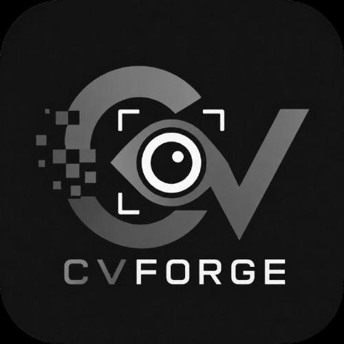 | 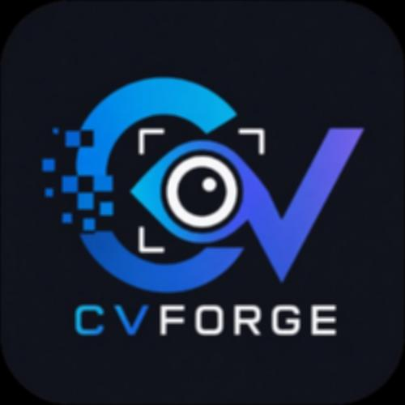 | 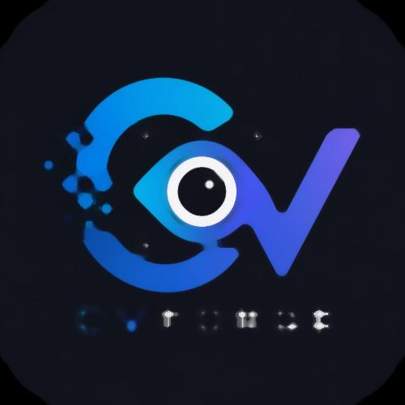 |

---

## Image Enhancement

| Sharpen | Emboss | Equalize |
|----------|---------|-----------|
| 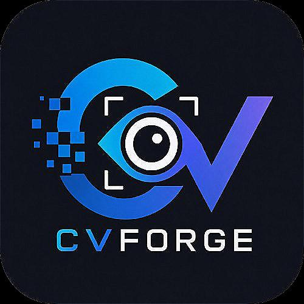 | 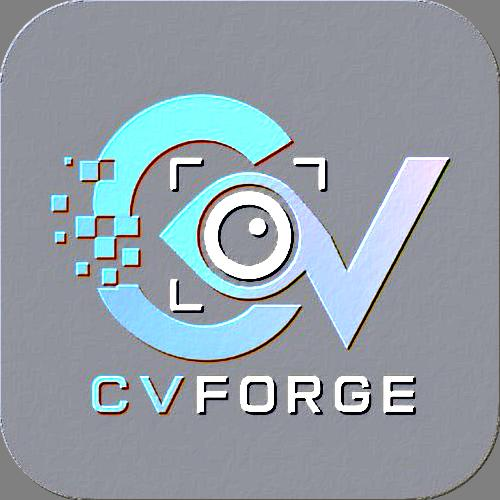 | 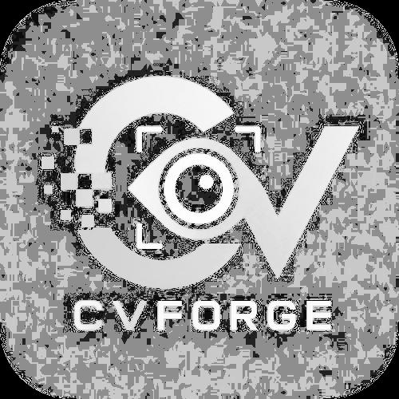 |

---

## Edge Detection

| Sobel |
|--------|
| 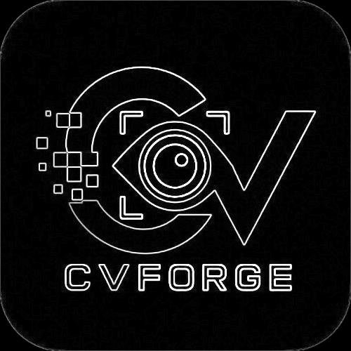 |

---

## Threshold

| Binary | Binary Inv |
|---------|------------|
| 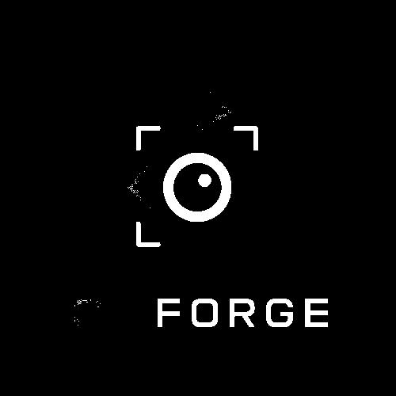 | 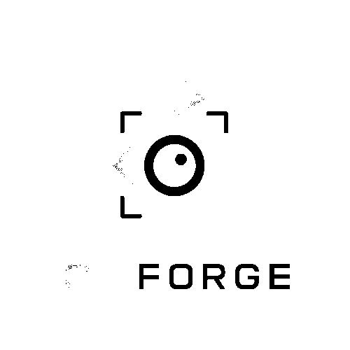 |

| Truncate | To Zero | To Zero Inv |
|-----------|----------|-------------|
| 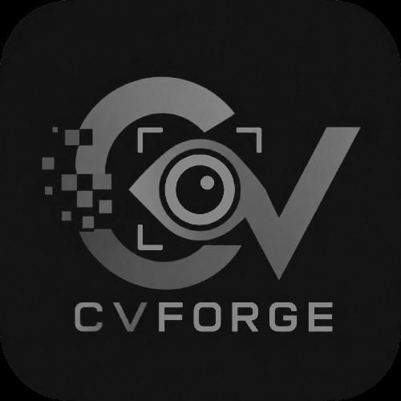 |  | 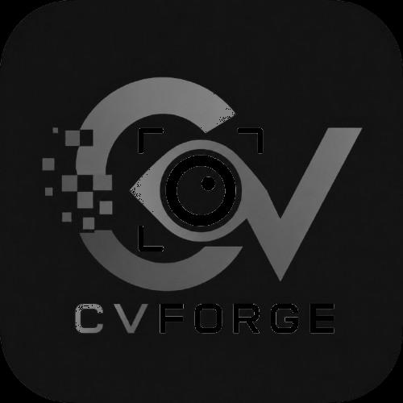 |


---

## Morphology

### Structuring Element Comparison

| Operation | Square | Cross |
|-----------|--------|-------|
| **Erosion** |  |  |
| **Dilation** | 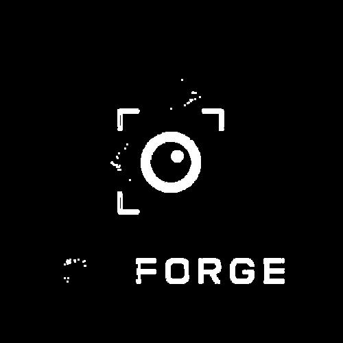 | 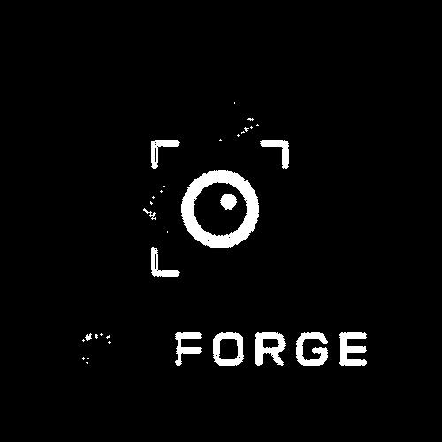 |
| **Opening** |  | 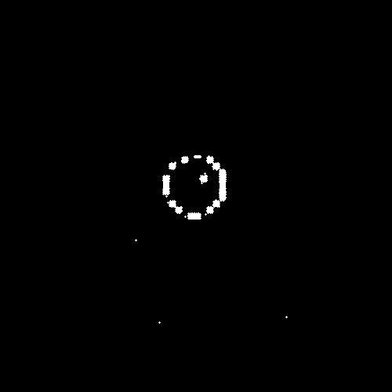 |
| **Closing** |  | 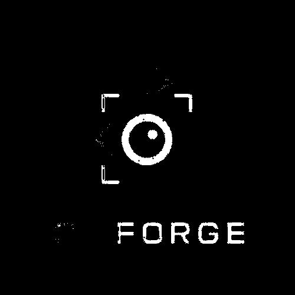 |
---

# Architecture

CVForge adopts a modular filter pipeline architecture.

Each image processing operation is implemented as an independent filter.

```text
             +-------------+
Input Image ->| Load Image |
             +-------------+
                    │
                    ▼
           +-----------------+
           | Filter Pipeline |
           +-----------------+
              │      │
              │      ├── Grayscale
              │      ├── Gaussian
              │      ├── Sobel
              │      ├── Threshold
              │      └── ...
                    ▼
             +-------------+
             | Save Image  |
             +-------------+
```

Every filter implements the same interface:

```go
type Filter interface {
    Process(
        image.Image,
        progress.Reporter,
    ) image.Image
}
```

---

# Project Structure

```text
CVForge
├── assets/
├── cmd/
│   ├── blur.go
│   ├── crop.go
│   ├── dilation.go
│   ├── emboss.go
│   ├── equalize.go
│   ├── erosion.go
│   ├── gaussian.go
│   ├── grayscale.go
│   ├── median.go
│   ├── opening.go
│   ├── closing.go
│   ├── resize.go
│   ├── rotate.go
│   ├── sobel.go
│   └── threshold.go
│
├── internal/
│   ├── filters/
│   ├── histogram/
│   ├── imageio/
│   ├── imageutil/
│   ├── kernel/
│   ├── morphology/
│   ├── pipeline/
│   ├── progress/
│   └── service/
│
├── examples/
└── main.go
```

---

# Supported Commands

| Command | Description |
|----------|-------------|
| `grayscale` | Convert image to grayscale |
| `blur` | Box blur |
| `gaussian` | Gaussian blur |
| `median` | Median blur |
| `resize` | Resize image |
| `rotate` | Rotate image |
| `crop` | Crop image |
| `sharpen` | Sharpen image |
| `emboss` | Emboss effect |
| `sobel` | Sobel edge detection |
| `threshold` | Binary thresholding |
| `equalize` | Histogram equalization |
| `erosion` | Morphological erosion |
| `dilation` | Morphological dilation |
| `opening` | Morphological opening |
| `closing` | Morphological closing |
---

# Installation

Clone the repository

```bash
git clone https://github.com/kylin419/CVforge.git
cd CVforge
```

Build

```bash
go build
```

---

# Usage

### Grayscale

```bash
cvforge grayscale input.jpg output.jpg
```

### Gaussian Blur

```bash
cvforge gaussian input.jpg output.jpg \
    --size 5 \
    --sigma 1.5
```

### Median Blur

```bash
cvforge median input.jpg output.jpg \
    --radius 2
```

### Resize

```bash
cvforge resize input.jpg output.jpg \
    --w 800 \
    --h 600
```

### Rotate

```bash
cvforge rotate input.jpg output.jpg \
    --angle 90
```

### Crop

```bash
cvforge crop input.jpg output.jpg \
    --x 100 \
    --y 50 \
    --w 400 \
    --h 300
```

### Threshold

```bash
cvforge threshold input.jpg output.jpg \
    --value 127 \
    --type binary
```

Available threshold types:

- binary
- binary-inv
- truncate
- tozero
- tozero-inv

### Histogram Equalization

```bash
cvforge equalize input.jpg output.jpg
```

### Erosion

```bash
cvforge erosion input.png output.png \
    --element square
```

### Dilation

```bash
cvforge dilation input.png output.png \
    --element square
```

### Opening

```bash
cvforge opening input.png output.png \
    --element square
```

### Closing

```bash
cvforge closing input.png output.png \
    --element square
```

Supported structuring elements:

- square
- cross

---

# Algorithms

## Filtering

- Box Blur
- Gaussian Blur
- Median Blur

## Convolution

- Generic Convolution Engine
- Dynamic Gaussian Kernel
- Preset Kernels

## Enhancement

- Sharpen
- Emboss
- Histogram Equalization

## Edge Detection

- Sobel Operator

## Thresholding

- Binary
- Binary Inverse
- Truncate
- To Zero
- To Zero Inverse

## Morphology

- Binary Erosion
- Binary Dilation
- Opening
- Closing
- Configurable Structuring Elements

---

# Design Goals

- Pure Go implementation
- No OpenCV dependency
- Modular filter pipeline
- Reusable convolution engine
- Reusable morphology engine
- Easy to extend
- Educational implementation of classical computer vision algorithms

---
# Performance

- Pure Go implementation
- Streaming image processing pipeline
- Progress reporting for long-running operations
- No external computer vision libraries

---

# Roadmap

## v1.3 ✅

- [x] Geometry Transformations
- [x] Grayscale
- [x] Generic Convolution Engine
- [x] Gaussian Blur
- [x] Median Blur
- [x] Sharpen
- [x] Emboss
- [x] Sobel Edge Detection
- [x] Histogram Equalization
- [x] Threshold Family

## v1.4 ✅

- [x] Morphological Operations
  - [x] Erosion
  - [x] Dilation
  - [x] Opening
  - [x] Closing

## v1.5

- [ ] Canny Edge Detection
- [ ] Histogram Visualization
- [ ] CLAHE

## v2.0

- [ ] Harris Corner Detection
- [ ] Hough Transform
- [ ] Template Matching

---

# License

MIT License

---

# Author

**Kylin**

GitHub: https://github.com/kylin419